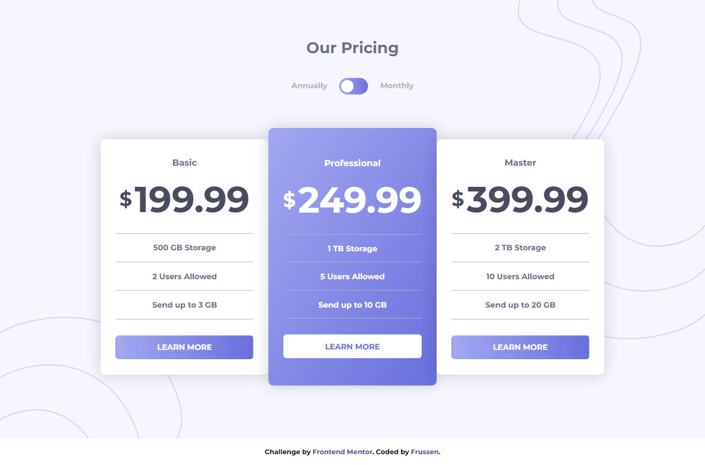

# Frontend Mentor - Pricing component with toggle solution

This is a solution to the [Pricing component with toggle challenge on Frontend Mentor](https://www.frontendmentor.io/challenges/pricing-component-with-toggle-8vPwRMIC). Frontend Mentor challenges help you improve your coding skills by building realistic projects. 

## Table of contents

- [Overview](#overview)
  - [The challenge](#the-challenge)
  - [Screenshot](#screenshot)
  - [Links](#links)
- [My process](#my-process)
  - [Built with](#built-with)
  - [What I learned](#what-i-learned)
  - [Continued development](#continued-development)
- [Author](#author)
- [Acknowledgments](#acknowledgments)

## Overview

### The challenge

Users should be able to:

- View the optimal layout for the component depending on their device's screen size
- Control the toggle with both their mouse/trackpad and their keyboard
- **Bonus**: Complete the challenge with just HTML and CSS

### Screenshot




### Links

- Solution URL: https://www.frontendmentor.io/solutions/flexbox-toggle-working-with-css-only-js-for-keyboard-control-AGvuJuc06l
- Live Site URL: https://frussen.github.io/FM2_Pricing-component-with-toggle/

## My process

### Built with

- Semantic HTML5 markup
- CSS custom properties
- Flexbox
- Mobile-first workflow
- CSS only working toggle

### What I learned

Thanks to this project I was able to practice a lot of concept and notion I had just learnt and even to learn some new things. For instance I built my first toggle and learned how to do it using the followng HTML elements: 

```html
<label class="switch">
  <input type="checkbox">
  <span class="slider"></span>
</label>
```
I also learned how to manage the overflow of an absolute positioned element, with the help of a div class .hideOverflow:

```css
header {
  position: relative;

  .hideOverflowTop {
    position: absolute;
    top: 0;
    right: 0;
    z-index: -1;
    overflow-x: hidden;

    img {
      position: relative;
      top: -37px;
      right: -196px;
    }
  }
}
```

Then I learned, that using display: table; and display: table-cell; allows you to effectively use vertical-align: middle; on the child element when it seems it doesn't work:

```css
h3 {
    display: table;
    margin: 0 auto 20.4px;
    padding: 0;
    font-size: 70px;
    color: $darkGrayishBlue;

    span {
      display: table-cell;
      vertical-align: middle;
      font-size: 38px;
      padding-right: 5px;
    }
  }
```

Lastly, I also learned how to use the input:focus and input:checked selectors to control other elements of the document thanks to the sibling selector "~". This, even if I had to reorginize the entire structure, allowed me to realize a functioning toggle without using any javascript code. Here it is what it looked like:

```css
input { 
  position: absolute;
  left: -10000px;
}
  
input:checked ~ .switch:after {
  transform: translateX(24px);
}

input:checked ~ .flex-container .card h3.mprice {
  display: table;
}

input:checked ~ .flex-container .card h3.yprice {
  display: none;
}
```

### Continued development

I would like to continue to do other more difficult Frontend Mentor Challenge, to advance my CSS and JavaScript skills. Hope to get better also in taking consideration of the tablet layout, which I skipped completely in this project (my second) and in the previous one.

## Author

- GitHub - https://github.com/Frussen
- Frontend Mentor - https://www.frontendmentor.io/profile/Frussen
- Twitter - https://twitter.com/frussen27

## Acknowledgments

I based the organization of the files and the programming workflow plus got inspirations for some tip and tecniques from the Youtube channel CoderCoder. The "build a website from scratch" playlist was for me really helpful so I will link it here:
https://www.youtube.com/watch?v=8w_kHIAkucA&list=PLUWqFDiirlsuYscECzks6zIZWr_Cfcx9k